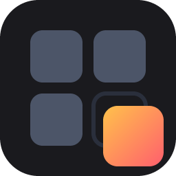

# BentoPick (WIP)

A hotkey-triggered overlay in the center of your screen for all your running apps and browser tabs represented as big icons that are easily clickable. Type filtering also supported.

Example:
1) Press `` Alt+` `` to immediately show BentoPick - See running apps, taskbar pins, and browser tabs in a grid of tiles.
2) Click what you want to switch to, or type to filter the grid

## Install

Windows 11 only.

### 1. The app

1. Download [bentopick.exe](https://github.com/rokubop/bentopick/releases/latest/download/bentopick.exe),
   or pick it off the [latest release](https://github.com/rokubop/bentopick/releases/latest).
2. Paste `%LOCALAPPDATA%\Programs` into the Explorer address bar, make a
   `bentopick` folder there, and move the exe into it.
3. Run it. Windows warns about an unrecognised app: **More info** -> **Run anyway**.
4. Press `` Alt+` ``.

Not `Program Files`. BentoPick writes its settings next to the exe, and that
folder needs admin to write to. Anywhere permanent that you own is fine.

Tray icon only, no window until you summon it. To update, copy a newer exe over
the old one.

### 2. Browser tabs (optional)

Only if you want tabs in the grid. Chromium browsers for now.

1. Download `bentopick-extension.zip` from the
   [same release](https://github.com/rokubop/bentopick/releases/latest) and unzip it.
2. Go to `chrome://extensions`, turn on Developer mode, click **Load unpacked**,
   pick the unzipped folder. It appears as **BentoPick bridge**.
3. Right-click the BentoPick tray icon: **Browser > Pair a browser...**. It
   shows six digits.
4. On the BentoPick bridge card click **Details > Extension options**, type the
   digits, click **Pair with BentoPick**.

Tabs appear in the grid straight away. To unpair: **Browser > Forget**.

### Start it at login

Press Win+R, type `shell:startup`, Enter. Put a shortcut to `bentopick.exe` in
the folder that opens.

Delete the shortcut to undo it.

## Build from source

If instead of downloading the exe you want to build it yourself.

Needs [Rust](https://rustup.rs). From **PowerShell, not WSL**, the toolchain and
the window are Windows-native.

```powershell
git clone https://github.com/rokubop/bentopick
cd bentopick
cargo build --release
target\release\bentopick.exe
```

`cargo build` without `--release` keeps a console window so the log is visible.

Careful which copy you are running. The panel reads the config next to whichever
exe started, so an installed copy and `target\release\` have separate settings.

## Running

Starts silent, tray icon only. Only one runs at a time: launch it again, from a
taskbar pin or anywhere else, and the panel comes up instead of a second copy.

Right-click the tray icon:

| Item | Does |
|---|---|
| Show BentoPick | Same as the hotkey |
| Add app… | Browse installed apps, Store apps included, and pin one |
| Add folder… | Pin a folder |
| Add file or shortcut… | Pin a file or `.lnk` |
| Browser ▸ | Pair a browser for tabs, or forget one |
| Edit settings… | Open `bentopick.toml` in your editor |
| Exit | Quit |

Log: `%LOCALAPPDATA%\bentopick\bentopick.log`

## Finding

Just type. The grid narrows on every character, and a strip at the top shows
what you typed and how much survived it.

| Key | Does |
|---|---|
| Any letter | Narrow the grid |
| Arrows | Move the selection |
| Enter | Take the selected tile |
| Home / End | First tile, last tile |
| Esc | Clear the query, then close the panel |

Every word has to match, so typing more always narrows. Both the title and the
second line are searched, which is how `github` finds a tab whose title never
says so.

Filtering hides tiles, it never reorders them. Tile positions are what make the
grid learnable, and the panel keeps its width while you type so it cannot slide
sideways under you.

## Arranging

Tiles arrange without a mode. Same as the taskbar or the bookmarks bar:

| Do | Get |
|---|---|
| Click a tile | Switch to it, or launch it |
| Drag a pinned tile | Reorder it inside its section |
| Right-click a running window | **Pin this app** |
| Right-click a pin | **Unpin**, **Open file location** |
| Right-click anywhere | Add app/folder/file, settings |

Click and drag never get confused: under the system's drag threshold is a click,
past it is a drag.

Only pinned tiles move. Running windows stay in most-recent order.

### Editing the layout

Click the **BentoPick** button in the bottom-right corner. It is always there,
always in the same place, and it opens a menu of big squares: **Edit layout**,
**Add app**, **Add folder**, **Add file**, **Settings**. Right-click still works
as a second path.

**Settings** opens six more squares. Each one is a value and each click steps
it to the next: tile size, whether tiles show a second line, how many columns,
and whether the browser bridge listens. They write straight into
`bentopick.toml` and your comments survive. **Open the file** is one of the six,
for the hotkey, the theme and the sections, which need typing.

In **Edit layout**, boxes light up as you move across them. Click one and its
options appear as tile-sized squares over the middle of the panel. The button in
the corner becomes **Stop editing**, so there is always a way out.

The options are three separate ideas, kept apart:

**Claim a side.** The box becomes the whole of it, full height or full width,
and whatever was there is moved off.

| | |
|---|---|
| **Full left** / **Full right** | The box becomes that column, top to bottom |
| **Full top** / **Full bottom** | The box becomes that row, edge to edge |

The square for the side a box already holds is **lit**, and reads **Leave
left**. Clicking it gives that side back, so one button says where the box is
and undoes it. There is no separate un-claim.

**Arrange.** What the boxes without a side of their own do.

| | |
|---|---|
| **Move up** / **Move down** | Earlier or later in the leftover stack |

**Size.**

| | |
|---|---|
| **Wider** / **Narrower** | More or less of its cut, for a box on a left or right side |
| **Taller** / **Shorter** | The same buttons, for a box on a top or bottom side |
| **Fewer tiles** / **More tiles** | How much of a long list it shows |

The size buttons say which way they will go. "Bigger" means wider for a box down
the left and taller for one across the bottom, so the button reads the way it
will move.

An option that would not apply is greyed out and does nothing. Greyed rather
than removed, so the squares never reshuffle under the pointer.

Centred and tile-sized on purpose. This panel is pointed at, sometimes by gaze,
and the middle of the screen is the cheapest place to reach.

Everything stays up while you edit, and every click is already written to
`bentopick.toml`. Finishing leaves the panel open and ready to use.

Every change goes straight into `bentopick.toml`. Nothing is remembered anywhere
else, and all of it can be undone by hand. Taskbar order is saved as an `order`
list, since Windows does not expose its own.

The panel closes the moment it loses focus.

## Config

`bentopick.toml`, next to the exe. Written with defaults on first run.

**No restart needed.** BentoPick watches the file and reloads on save, hotkey
included. Pins added from the tray are written here, and hand-written comments
and formatting are preserved.

```toml
hotkey = "alt+`"     # ctrl, alt, shift, win + a key
dry_run = false      # true: log what a click would do, do nothing
```

### Sections

Order here is order on screen. Empty sections do not render.

Running things are listed before launchable ones, because switching to something
that exists beats starting something new. Out of the box that is three headers:
`Browsing` (browser windows and tabs), `Active` (every other window), and
`Apps` (taskbar pins and anything you pin yourself).

`Apps` mirrors your taskbar:

- same pins, same left-to-right order
- a line under the icon when the app is open
- clicking an open one switches to it, never starts a second copy
- open but unpinned apps follow the pins

So a pin sits where you already know it, running or not.

`Apps` lists apps. `Browsing` and `Active` list windows and tabs, which is a
different question.

```toml
[[sections]]
title  = "Browsing"
source = "windows"
match  = ["chrome.exe", "msedge.exe", "firefox.exe"]

[[sections]]
title  = "Files"
source = "windows"
match  = ["explorer.exe"]

[[sections]]
title  = "Active"
source = "extra"     # windows the Apps row cannot reach; see below

[[sections]]
title  = "Apps"
source = ["taskbar", "running"]  # your taskbar pins, then anything else open
order  = []          # pin names, in order; written by dragging a tile.
                     # Empty means the taskbar's own order is mirrored.

[[sections]]
title  = "Places"
source = "manual"
items = [
    'R:\dev',
    { title = "Display", target = "ms-settings:display" },
    { title = "Wikipedia", target = "https://wikipedia.org" },
]
```

Two keys place a section's box. Both optional, both set by **Edit layout**:

```toml
[[sections]]
title     = "Launch"
source    = "taskbar"
at        = "left@35"   # the whole left side, 35% of the width
max_items = 12          # most tiles to show; omit for all of them
```

The panel is one rectangle cut in two, over and over - the same structure a
tiling window manager uses. `at` is the run of cuts from the whole panel inward:

| `at` | Where the box goes |
|---|---|
| `"left"` | The whole left side, top to bottom |
| `"bottom"` | The whole bottom, edge to edge |
| `"right/top"` | The top of what is left after the right-hand cut |
| `"left@35"` | The left side, pinned to 35% of the width |

Sections that say nothing fill whatever the cuts left over, stacking in the
order they are listed. So `at = "left"` on one section is a complete
instruction: that box down the left, everything else filling the right.

A share pins one side of a cut; without one, the two halves are sized by what
they hold. `"left@35"` and `"right@65"` describe the same panel.

Claiming a side takes the whole of it, so anything else already there is moved
off and goes back to filling the rest.

`max_items` is what a tabs or bookmarks box wants: both lists are as long as the
browser makes them, and a box that grows without limit pushes the rest off
screen.

`match` lists process names, case-insensitive, and only applies to `windows` and
`extra`. Sections claim windows in order and each window is claimed once, so put
filtered sections above the unfiltered catch-all. Keep exactly one windows
section without a `match`, or windows from an unlisted app have nowhere to go.

`extra` is `windows` minus the redundant half: only apps with **more than one**
window open.

One window is already in `Apps` under its own name, so repeating it by title
says nothing. Four windows is the opposite: the `Apps` tile reaches only the
most recent, and the titles pick the rest.

So an `extra` section stays empty until it has something to add. It needs apps
coming from `taskbar` and `running`. Alone it leaves single-window apps
unreachable.

Use `'single quotes'` for Windows paths. Inside `"double quotes"` TOML reads `\`
as an escape, so `"R:\dev"` is a parse error.

A manual `target` is anything the shell can open:

| Target | Example |
|---|---|
| Folder | `'R:\dev'` |
| App or file | `'C:\Windows\notepad.exe'` |
| Shortcut | `'C:\...\Thing.lnk'` |
| Store app | `'shell:AppsFolder\<AppUserModelID>'` |
| Settings page | `"ms-settings:display"` |
| Link | `"https://example.com"` |

Bare strings get their title from the path. Use the `{ title, target }` form to
choose one.

### Browser tabs

Off by default. Windows has no API for browser tabs, so this needs an extension:
`extension/`, Chromium only for now.

```toml
[[sections]]
title  = "Browsing"  # the default: extra windows first, then tabs
source = [
    # Only once a browser has a second window: one is reached from Apps.
    { source = "extra", match = ["chrome.exe", "msedge.exe", "firefox.exe"] },
    "tabs",          # empty until the extension connects
]

[browser]
enabled = true
port    = 8777
```

Pairing is not a config edit. Load the extension, then right-click the tray
icon: **Browser > Pair a browser...**. BentoPick shows six digits, you type them
into the extension's options page, and that is the whole setup - it switches the
bridge on for you if it was off. **Browser > Forget** undoes it.
`extension/README.md` has the details.

Tabs sit under the same header as your browser windows, right behind them,
since both answer the same question.

### Bookmarks

Same extension, same switch, no extra setup. Add a `bookmarks` source:

```toml
[[sections]]
title     = "Bookmarks"
source    = "bookmarks"
max_items = 12
```

The **bookmarks bar only**, one level deep. Not "Other bookmarks", which is an
archive of thousands and would bury the panel it was pasted into, and not the
folders sitting on the bar, since there is nothing BentoPick could do with one.

A bookmark tile is a URL handed to the shell, so it opens in your default
browser and works whether or not the browser that sent it is still running.

Read-only, and it stays that way: nothing is ever written to a browser profile.
"Bookmark this tab" is not built - to add one, use the browser.

**Read this before turning it on.** It opens a port on your machine that only
your own computer can reach, and it installs an extension that can read the
title and URL of every tab you have open. Both are the feature working as
intended, and both are your call.

What guards that port:

- Nothing is admitted that you have not paired, and pairing takes a code shown
  by the app itself. Turning the bridge on grants nothing on its own.
- Websites cannot get in. Any page can try to open a connection to your own
  machine, but browsers stamp every connection with who is making it and pages
  cannot fake that stamp. Only a paired extension is let through.
- A separate secret per browser, from the OS random generator, kept in
  `%LOCALAPPDATA%\bentopick\peers.json`, which Windows restricts to your
  account. It never travels over the socket; each side proves it knows it.

And the guard that points the other way: **BentoPick proves itself to the
extension too**, before the extension sends a single tab title. Otherwise
anything that grabbed port 8777 first would be handed your open tabs by an
extension with no way to tell the difference. For the same reason, pairing is
refused outright when something else holds the port, and the tray says so
instead of failing quietly.

What it does not guard against: software already running under your own account.
That software can read the tokens, but it can also read your browser profile
directly, so this is not the interesting way in. `src/browser/gate.rs` has the
full reasoning at the top of the file.

### Appearance

Tile size is fixed. It never changes with item count, which is what makes tile
positions learnable. The panel grows outward from center until it hits
`max_screen_fraction` of the monitor, then scrolls.

Defaults fit about 60 tiles on a 1080p monitor. Raise `tile_width` and
`tile_height` if you want fewer, larger ones.

```toml
[grid]
tile_width = 140.0
tile_height = 100.0
gap = 10.0
padding = 18.0
max_screen_fraction = 0.8
max_columns = 9          # hard column cap; 0 means whatever fits
label_height = 24.0
show_detail = false      # true: second line with process name or path
header_height = 22.0     # 0 hides section headers
header_gap    = 6.0      # between a section title and its first row
section_gap = 10.0
corner_radius = 8.0

[theme]
panel = "#F01A1A1E"      # #AARRGGBB or #RRGGBB
tile = "#FF2A2A32"
tile_hover = "#FF3C3C48"
text = "#FFE8E8EC"
header = "#FF9A9AA8"
tile_drag = "#FF4A4460"    # a tile being dragged
tile_selected = "#FF4C5A78"  # the tile Enter would take
```

```toml
[grid]
search_height = 72.0     # the filter strip; its text is sized from this
```

## Why it's built this way

Hand-written layout and hit-testing on Windows.UI.Composition, no GUI framework.
The Rust GUI landscape is still weak, with a
[2026 survey](https://alexzhang-5109.xlog.app/-yi--pan-dian-zai-WASM-shi-jie-zhong-yong-xian-de-ji-shi-ge-Rust-GUI?locale=en)
putting 94.4% of crates at not production ready: Xilem isn't there, egui is a
debug UI with limited styling, iced has doc gaps, Dioxus is WebView underneath.
A framework earns its keep on complex UI anyway, and this is a uniform grid of
identical tiles, so layout is a few hundred lines.

C#, WPF or WinUI 3 would have been faster to build, but idle RSS runs 50-60MB or
120MB against 15-20MB native, and this process is resident all day. Tauri and
Electron add a second resident process on top of that, and can't reach the shell
APIs that justify going native at all.

The hotkey is `RegisterHotKey`, never `WH_KEYBOARD_LL`. A low-level hook sits in
every keystroke on the machine, degrading input latency everywhere and
attracting security tooling. `RegisterHotKey` is process-scoped, released by the
OS even on a crash, and
[counts as the last input event](https://learn.microsoft.com/en-us/windows/win32/api/winuser/nf-winuser-setforegroundwindow),
which is what grants the foreground right to activate another window.

Tabs arrive over a loopback WebSocket rather than native messaging, the
documented transport. MV3 service workers die after ~30s idle, and there are
[reports of them dying anyway](https://github.com/GoogleChrome/developer.chrome.com/issues/2688)
at 5-6 minutes with `connectNative()`. Chrome 116+ keeps the worker alive as
long as messages flow. Native messaging would also have the browser spawn the
host, and BentoPick is a long-running GUI that would end up with a second copy
of itself - plus a registry key and a host manifest, which is footprint this app
does not want.

What a fixed port costs is that something else can take it, and an extension
cannot read a file to find out where BentoPick went. So the answer is not a
fallback port but a handshake: both ends prove they know the token, BentoPick
going first, and a bind failure is reported in the tray rather than retried
around.

## Known gaps

- Unpinned running apps are named by their executable: `WindowsTerminal`, not
  `Windows Terminal`. Pins are named by their shortcut and read properly.
- A Store app pinned to the taskbar matches no window, so it never shows as
  running. It pins by AppUserModelID with no target path.
- Bookmarks are read-only, Chromium only, and the bookmarks bar only.
- A box cannot be dragged to another row. Edit layout moves it a place at a
  time, which is the same thing in more keystrokes.
- Firefox needs its own extension build.
- Tab tiles cannot be rearranged, and neither can a filtered grid.
- Dragging moves a tile within its own section. Moving one between sections
  means editing `bentopick.toml`.
