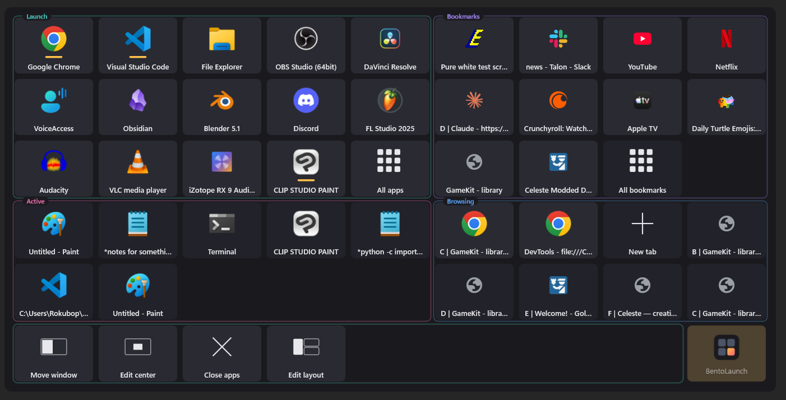

# BentoLaunch (WIP)

A hotkey-triggered overlay in the center of your screen for all your running apps and browser tabs represented as big icons that are easily clickable. Type filtering also supported.



Example:
1) Press `` Alt+` `` to immediately show BentoLaunch - See running apps, taskbar pins, and browser tabs in a grid of tiles.
2) Click what you want to switch to, or type to filter the grid

## Install

Windows 11 only. Two files, the exe and the browser extension, and they have to
come from the same release - they check each other's version.

**[Download the latest release](https://github.com/rokubop/bentolaunch/releases/latest)**
- step by step instructions are on that page.

## Build from source

If instead of downloading the exe you want to build it yourself.

Needs [Rust](https://rustup.rs). From **PowerShell, not WSL**, the toolchain and
the window are Windows-native.

```powershell
git clone https://github.com/rokubop/bentolaunch
cd bentolaunch
cargo build --release
target\release\bentolaunch.exe
```

`cargo build` without `--release` keeps a console window so the log is visible.

Careful which copy you are running. The panel reads the config next to whichever
exe started, so an installed copy and `target\release\` have separate settings.

## Running

Starts silent, tray icon only. Only one runs at a time: launch it again, from a
taskbar pin or anywhere else, and the panel comes up instead of a second copy.

Right-click the tray icon:

| Item | Does |
|---|---|
| Show BentoLaunch | Same as the hotkey |
| Add app… | Browse installed apps, Store apps included, and pin one |
| Add folder… | Pin a folder |
| Add file or shortcut… | Pin a file or `.lnk` |
| Browser ▸ | Pair a browser for tabs, or forget one |
| Edit settings… | Open `bentolaunch.toml` in your editor |
| Exit | Quit |

Log: `%LOCALAPPDATA%\bentolaunch\bentolaunch.log`

That directory also holds `peers.json`, the paired browsers, and
`bentolaunch.toml.bak`, the config as it was before the last **Reset layout**.

## Finding

Just type. The grid narrows on every character, and a strip at the top shows
what you typed and how much survived it.

| Key | Does |
|---|---|
| Any letter | Narrow the grid |
| Arrows | Move the selection |
| Enter | Take the selected tile |
| Home / End | First tile, last tile |
| Esc | Clear the query, then close the panel |

Every word has to match, so typing more always narrows. Both the title and the
second line are searched, which is how `github` finds a tab whose title never
says so.

Filtering hides tiles, it never reorders them. Tile positions are what make the
grid learnable, and the panel keeps its width while you type so it cannot slide
sideways under you.

## All of them

The last square in **Apps**, and the last square in **Bookmarks**. Nine squares
where the box shows a handful. Either one fills the panel with the whole list in
place of the grid: type to narrow it, click to take it, corner button to leave.

Both boxes show a row somebody curated — the taskbar's pins, the bookmarks bar.
Anything not on either had no way onto the panel at all. These are that way in,
and each is last in its box because a box's whole worth is that its tiles are
where they were last time.

**All apps** comes off `shell:AppsFolder`, the same virtual folder the **Add
app** picker opens, so Store apps are in it too. Read on a worker, never on the
UI thread, and re-read every five minutes, so something installed while the app
is running turns up without a restart.

**All bookmarks** is the whole tree, flat, with the folder each one is filed
under on its second line. Flat because the tree is an archive of thousands and
walking it a folder at a time is several clicks to a place three letters already
reach. Still read-only: BentoLaunch never writes to a browser profile.

That second line is drawn here whatever `show_detail` says, and it is the only
place that overrides it. Five videos saved out of one series have five
near-identical titles and the folder is the only thing telling them apart. It
costs no layout — both lines share the strip the title already has to itself.

The bar is not named on the line. It is where most bookmarks are, and printing
it on nine tiles in ten would spend the line saying "the usual place"; a
bookmark sitting on the bar itself shows its site instead. Every other root
keeps its name, because "Other bookmarks" is the part worth knowing.

The tree is **asked for, not sent**. The bar arrives on connect because it is on
the panel all the time; the archive crosses the socket only when the square is
clicked, and it is asked again each time so an edit made since is in the answer.
Capped at 5000, and the extension says so in its console when it cuts one.

No favicons come with it. One favicon is filed per site, so a bookmark sharing a
site with an open tab or a bar entry already wears the right picture; the rest
fall back to the shell, exactly as a hand-written site favorite does. Fetching
one for every distinct site in an archive would be minutes of work and megabytes
of socket.

The square only appears while a browser is connected, since nothing else can
answer for the tree. An extension too old to know the question leaves the box
empty rather than breaking the connection — the same trade **Open a tab** makes,
and the reason neither is a protocol bump: refusing the connection would cost
every tab to save one square.

## The center

A block held in the middle of the screen, holding whatever you put there.

Everything else on the panel comes and goes with what is running. This does not.
It is the same tiles in the same squares every summon, in the one place you never
have to look for — which is why it is worth reserving, and why what goes in it is
chosen by hand.

Two halves: **apps on the left, sites on the right.** Starting something and
opening a page are different questions, and keeping them apart is what lets you
hit the right square without reading it.

**An empty block draws nothing**, whatever `rows` and `columns` say. Eighteen
empty squares in the middle of the screen is the one place on the panel worth
reserving spent on nothing. Right-click anything and choose **Add to center**,
or use **Edit center**, and the block appears around the first one. Add one that would not
fit and the block grows to the least rectangle that holds them: one favorite is
one square, two are 2 x 1, four are 4 x 1, five are 3 x 2. Up to 4 x 4 a half.

Holding something, it draws its whole shape — empty slots included. Those are
where the next one lands, and they stay put as things come and go: a block that
shrank to fit would move every square you had learned the position of. Empty it
completely and it collapses again. Coming back down a size is a click in edit
mode.

Empty squares are drawn, not left out. A block that shrank as it emptied would
be a set of moving targets, which is the one thing a gaze pointer cannot use.
Click an empty one and **Edit center** opens.

| Do | Get |
|---|---|
| Click **Edit center**, then a tile | It moves into the center |
| Click **Edit center**, then a center tile | It comes back out |
| Drag inside a half | Reorder it |
| Right-click a tile | **Add to center**, **Remove from center** |

While the mode is on, everything the center is already holding wears a **⊖** in
its corner: the warm fill says this one is in, and the badge says which way the
next click goes.

Three states, so the panel reads as a field rather than tile by tile:

| Tile | Means |
|---|---|
| Warm fill, **⊖** badge | Already in the center. Clicking takes it out |
| Normal | Can go in |
| Faded | Cannot. Nothing to write down, or its half is full |

The empty square the next pick lands in wears a ring, and the ring follows the
pointer: an app rings the apps square, a page rings the sites one. Clicking an
empty square enters the mode aimed at that half; clicking the square it is
already aimed at leaves, like every other mode square.

A half with no empty square left refuses. The block shows `rows × columns` of a
list and keeps the rest, so a write into a full half would be taken and never
drawn — the same click with no visible result a half `contents` is not showing
would give. Take one out, or grow the block.

Anything in the center is left out of the list it came from. One thing in two
places costs a fixed slot the only property that makes it worth having.

Windows are not: favoriting Chrome says where to start one and says nothing
about the four Chrome windows already open.

**The bento does not know it is there.** Every cut in the layout tree runs edge
to edge, so a box in the middle would drag its lines across the whole panel.
Instead the center claims its rectangle first and the boxes are laid out as if
it were not there — they **wrap** around it, left of it and right of it, in
reading order, one box and not two.

**It lands on whole cells of the grid.** Not a rectangle dropped on top of the
panel: the middle few squares *of* it, framed. Off the grid it costs every row
it grazes — a row overlapping it by ten pixels loses its middle columns exactly
as a row sitting squarely behind it does — and the panel fills with space that
is not holding anything.

So the grid still reads as one grid, and the block is what is drawn in front of
it: a frame around the whole block, and a seam down the middle saying which half
is which. The frame is the one line on the panel that crosses a box edge instead
of stopping at it, which is the whole of how it says it is on top.

A box that fits on one row is a bar, and a bar wrapped around the middle is
unreadable. Bars slide past the block instead. Wrapping is for a box big enough
that going round saves it a row.

The block is centred on the **screen**, not on the panel: wrapping is a step
function — nudge the hole down half a tile and a whole row comes free, which
shortens the panel, which moves the hole back up — so the two would trade places
forever. The panel moves instead. It is only what happens to be drawn on the
screen, and it is free to sit wherever it has to.

`[center]` in the config is the whole of it:

```toml
[center]
rows     = 3        # tiles down, per half. 0 turns the block off
columns  = 3        # tiles across, per half. Four each way is the ceiling
contents = "split"  # "split", "one", "apps", "sites"
```

`split` is apps and sites side by side; `one` is both lists in a single block,
apps first; `apps` and `sites` are one list alone. The other list is still kept
and still comes back when the setting does. While it is not being shown it stays
in the box it came from, rather than vanishing off the panel entirely.

**Center holds · apps + sites** in Settings steps what it holds. The shape is in
**Edit layout**, on the block itself.

## Modes

Four squares in a row that never moves — including when the grid is long
enough to scroll. The bar is pinned to the foot of the panel and the grid slides
under it. Each turns on a mode.

**Move window** brings six squares of its own, and they take this row rather
than stacking a second bar under it. Its own square leads them, lit while the
mode is on: click it to finish, the same as every other mode square. The panel
stays open the whole time, so a click picks the window to move rather than
switching to it, and you can move one after another. Clicking it
again, another mode's square, the corner button, or Escape turns it off, and
clicking off the panel dismisses it, in a mode exactly as out of one. A mode
square is never greyed and never swallows its own click: a mode with one way out
is a mode you can be stuck in.

| Square | While it is on |
|---|---|
| **Move window** | The six moves appear, and clicking a tile picks the window to move |
| **Edit center** | Clicking fills and empties the center |
| **Close apps** | Clicking closes the window behind a tile |
| **Edit layout** | Clicking picks a box and the options rearrange the bento |

Modes rather than modifiers. Nothing that points with gaze can hold a key down,
so anything that changes what a click means has to be a square you aim at once
and a square you aim at to leave. The corner button reads **Done** in every one
of them, so there is never a mode with no visible way out.

**Move window** is why the six moves stopped being a row of their own. Six
squares that only ever apply to one window at a time cannot hold a row all the
time; the mode brings them out on the click that needs them and puts them away
after. Add `source = "modes"` to a section to get the bar, and keep a
`source = "move"` box for the six to appear in. Listed without a `modes` box
anywhere, `move` is the old always-on bar and stays on.

Closing is `WM_CLOSE`, the same polite ask the taskbar's "Close window" makes:
the app gets to prompt about unsaved work, and gets to refuse. Nothing here ever
terminates a process.

## Arranging

Tiles arrange without a mode. Same as the taskbar or the bookmarks bar:

| Do | Get |
|---|---|
| Click a tile | Switch to it, or launch it |
| Drag a pinned tile | Reorder it inside its section |
| Right-click a running window | **Pin this app** |
| Right-click a pin | **Unpin**, **Open file location** |
| Right-click anywhere | Add app/folder/file, settings |

Click and drag never get confused: under the system's drag threshold is a click,
past it is a drag.

Only pinned tiles move. Running windows stay in most-recent order.

### Editing the layout

Click the **BentoLaunch** button in the bottom-right corner. It is always there,
always in the same place, and it opens a menu of big squares: the four modes,
then **Add app**, **Add folder**, **Add file**, **Settings**. The modes bar in
the grid is the first way to reach them; this is the second, and right-click is
the third.

Right-clicking a tile says where it goes rather than what it is: **Add to
Launch**, **Add to Center**, **Remove from Launch**. One verb, and the half
worth reading is the destination. The box named is the one it will actually
land in, read from the config rather than assumed.

**Settings** opens eight more squares. Each says its own name and where it
stands - **Tiles · medium**, **Columns · 9**, **Center holds · apps + sites**
- and each click steps it to the next value. They write straight into
`bentolaunch.toml` and your comments survive. **Open the file** is one of the
eight, for the hotkey, the theme and the sections, which need typing.

The block's *size* is not here. It has four squares in **Edit layout**, where
the block is on screen next to them: a shape needs two directions, and a surface
covering the thing you are sizing can give neither.

A square that would do nothing where the config stands is greyed rather than
removed — **Center · apps + sites** with no center block, for instance — so the
squares never reshuffle under the pointer.

### Reset layout

**Reset layout** is one of the eight, one square away from **Done** so the two
worst to confuse are not neighbours. It puts the
boxes back in their stock lanes and order, the grid back to stock tiles and
columns, and the center block back to the shape that fits what it holds.

It asks first, and the question takes the whole surface: the eight squares go,
and two arrive — **Keep my layout** and **Reset the layout**. Neither is where
the square you clicked was, so a second click cannot answer by accident. Escape
or the corner button backs out of the question without answering it.

Afterwards the square greys out, which is how this surface says a click would
do nothing, and stays grey until something moves a box again. A box you wrote
yourself does not count against that — a reset keeps it, so it is stock with it
there.

It only touches layout. Your hotkey, theme, browser switch, hand-added apps and
files, dragged pin order, and the center block's own contents all come through
untouched, comments and all. Paired browsers are in `peers.json` rather than the
config, so a reset cannot unpair anything. A box you wrote yourself is kept as
it is, after the stock ones; a stock box you deleted comes back.

The file it replaced is copied to
`%LOCALAPPDATA%entolaunchentolaunch.toml.bak` first. One file, overwritten
each time — the undo of the last reset, not a history of them.

In **Edit layout**, boxes light up as you move across them. Click one and its
options appear as tile-sized squares over the middle of the panel. The button in
the corner becomes **Stop editing**, so there is always a way out.

The center block is not one of the boxes. It is not in the tree, so none of the
options has anything to say about it; the box behind it answers a click instead.

The options are three separate ideas, kept apart:

**Claim a side.** The box becomes the whole of it, full height or full width,
and whatever was there is moved off.

| | |
|---|---|
| **Full left** / **Full right** | The box becomes that column, top to bottom |
| **Full top** / **Full bottom** | The box becomes that row, edge to edge |

The square for the side a box already holds is **lit**, and reads **Leave
left**. Clicking it gives that side back, so one button says where the box is
and undoes it. There is no separate un-claim.

**Arrange.** What the boxes without a side of their own do.

| | |
|---|---|
| **Move up** / **Move down** | Earlier or later in the leftover stack |

**Size.**

| | |
|---|---|
| **Wider** / **Narrower** | More or less of its cut, for a box on a left or right side |
| **Taller** / **Shorter** | The same buttons, for a box on a top or bottom side |
| **Fewer tiles** / **More tiles** | How much of a long list it shows |

The size buttons say which way they will go. "Bigger" means wider for a box down
the left and taller for one across the bottom, so the button reads the way it
will move.

An option that would not apply is greyed out and does nothing. Greyed rather
than removed, so the squares never reshuffle under the pointer.

Centred and tile-sized on purpose. This panel is pointed at, sometimes by gaze,
and the middle of the screen is the cheapest place to reach.

Everything stays up while you edit, and every click is already written to
`bentolaunch.toml`. Finishing leaves the panel open and ready to use.

Every change goes straight into `bentolaunch.toml`. Nothing is remembered anywhere
else, and all of it can be undone by hand. Taskbar order is saved as an `order`
list, since Windows does not expose its own.

The panel closes the moment it loses focus.

## Config

`bentolaunch.toml`, next to the exe. Written with defaults on first run.

**No restart needed.** BentoLaunch watches the file and reloads on save, hotkey
included. Pins added from the tray are written here, and hand-written comments
and formatting are preserved.

```toml
hotkey = "alt+`"     # ctrl, alt, shift, win + a key
dry_run = false      # true: log what a click would do, do nothing
```

### Sections

Order here is order on screen. Empty sections do not render.

Out of the box the panel is split down the middle: **`Browsing` down the whole
right side, everything else down the left**, with the modes bar across the
bottom. Two halves and one question each — what is open on the web, and what is
on this machine — and a panel split that way is answered by looking at one half
of it, which no stack of full-width rows manages. It also gives the center block
a half to sit in on either side of it.

The left half is `Active` (every window) over `Apps` (taskbar pins and anything
you pin yourself). Running things above launchable ones, because switching to
something that exists beats starting something new.

`Apps` mirrors your taskbar:

- same pins, same left-to-right order
- a line under the icon when the app is open
- clicking an open one switches to it, never starts a second copy
- open but unpinned apps follow the pins

So a pin sits where you already know it, running or not.

`Apps` lists apps. `Browsing` and `Active` list windows and tabs, which is a
different question.

```toml
[[sections]]
title  = "Browsing"
source = "windows"
match  = ["chrome.exe", "msedge.exe", "firefox.exe"]
side   = "right"     # the whole right side; everything else fills the left

[[sections]]
title  = "Files"
source = "windows"
match  = ["explorer.exe"]

[[sections]]
title  = "Active"
source = "extra"     # windows the Apps row cannot reach; see below

[[sections]]
title  = "Apps"
source = ["taskbar", "running"]  # your taskbar pins, then anything else open
order  = []          # pin names, in order; written by dragging a tile.
                     # Empty means the taskbar's own order is mirrored.

[[sections]]
title  = "Places"
source = "manual"
items = [
    'R:\dev',
    { title = "Display", target = "ms-settings:display" },
    { title = "Wikipedia", target = "https://wikipedia.org" },
]

# Empty until move mode brings the six out, so it costs a row only while it is
# being used. Takes the modes bar's row while it is out: the foot of the
# panel is one row, and the two take turns.
[[sections]]
title  = ""
source = "move"
side   = "full"

[[sections]]
title  = ""
source = "modes"
side   = "full"
```

Two keys place a section's box. Both optional, both set by **Edit layout**:

```toml
[[sections]]
title     = "Launch"
source    = "taskbar"
side      = "left"      # which lane: "left", "right" or "full"
max_items = 12          # most tiles to show; omit for all of them
```

A box picks a lane, and that is the whole of its x axis:

| `side` | Where the box goes |
|---|---|
| `"left"` | The left lane, top to bottom |
| `"right"` | The right lane |
| `"full"` | Edge to edge |

Height is not a choice - a box is as tall as what it holds - so the only other
thing to say is where it comes in its lane, which is the order it is listed in
the file. A box that says nothing takes the default lane.

A lane is a property of one box, never a relationship with another. "Left" is
still the left half when nothing is on the right, so a box does not change shape
because a browser disconnected. Where the seam down the panel sits is
`grid.split`: one number for the whole panel, hand-edited.

`max_items` is what a tabs or bookmarks box wants: both lists are as long as the
browser makes them, and a box that grows without limit pushes the rest off
screen.

`match` lists process names, case-insensitive, and only applies to `windows` and
`extra`. Sections claim windows in order and each window is claimed once, so put
filtered sections above the unfiltered catch-all. Keep exactly one windows
section without a `match`, or windows from an unlisted app have nowhere to go.

`extra` is `windows` minus the redundant half: only apps with **more than one**
window open.

One window is already in `Apps` under its own name, so repeating it by title
says nothing. Four windows is the opposite: the `Apps` tile reaches only the
most recent, and the titles pick the rest.

So an `extra` section stays empty until it has something to add. It needs apps
coming from `taskbar` and `running`. Alone it leaves single-window apps
unreachable.

Use `'single quotes'` for Windows paths. Inside `"double quotes"` TOML reads `\`
as an escape, so `"R:\dev"` is a parse error.

A manual `target` is anything the shell can open:

| Target | Example |
|---|---|
| Folder | `'R:\dev'` |
| App or file | `'C:\Windows\notepad.exe'` |
| Shortcut | `'C:\...\Thing.lnk'` |
| Store app | `'shell:AppsFolder\<AppUserModelID>'` |
| Settings page | `"ms-settings:display"` |
| Link | `"https://example.com"` |

Bare strings get their title from the path. Use the `{ title, target }` form to
choose one.

### Browser tabs

Off by default. Windows has no API for browser tabs, so this needs an extension:
`extension/`, Chromium only for now.

```toml
[[sections]]
title  = "Browsing"  # the default: extra windows first, then tabs
source = [
    # Only once a browser has a second window: one is reached from Apps.
    { source = "extra", match = ["chrome.exe", "msedge.exe", "firefox.exe"] },
    "tabs",          # empty until the extension connects
]

[browser]
enabled = true
port    = 8777
```

Pairing is not a config edit. Load the extension, then right-click the tray
icon: **Browser > Pair a browser...**. BentoLaunch shows six digits, you type them
into the extension's options page, and that is the whole setup - it switches the
bridge on for you if it was off. **Browser > Forget** undoes it.
`extension/README.md` has the details.

Tabs sit under the same header as your browser windows, right behind them,
since both answer the same question.

### The center block

Its own table, not a section: nothing `at` can say puts a box in the middle
without cutting the panel in half to get there.

```toml
[center]
rows     = 0       # 0 turns the block off, and is what it ships as;
                   # an empty block draws nothing whatever this says
columns  = 3       # tiles across in each half; rows * columns is a half's slots
contents = "split" # "split", "one", "apps", "sites" - see The center
color    = "#38FFC24B"
apps  = [
    'C:\Program Files\Some\App.exe',
    { title = "Dev", target = 'R:\dev' },
]
sites = [
    "https://wikipedia.org",
    { title = "Docs", target = "https://docs.example" },
]
```

Both lists take the same entries a manual section's `items` does: a path, a
`.lnk`, `shell:AppsFolder\<AppUserModelID>`, or a URI. **Edit center** writes
them; hand-editing works the same as everywhere else here.

A site wears its own favicon when a paired browser has sent one for that site,
and the shell's icon for the URL otherwise — which is the default browser's
logo, the same for every site. Four identical logos in the middle of the screen
is the block failing at the only thing it is for, so the favicon is asked for
every time the grid is built: connect a browser and they arrive on the next
summon.

`rows = 0` is how the block is turned off. How much center you want and whether
you want any are the same question, so one settings square answers it.

Turning `split` off gives one box, `columns` wide, holding the apps and then the
sites. It is narrower, not the same block merged — the width is what `columns`
says either way.

`rows` and `columns` are capped at four each. The block is held in the middle
and everything wraps around it, so one bigger than the panel would leave the
grid nowhere to wrap to.

The block wins over `max_columns`: that cap is a preference about how long a row
stays scannable, and a block hanging off the edge of the panel is a click that
lands on nothing. It still yields to what fits the screen. The panel may also
come out one column wider than it needed, to keep the spare columns even so the
block lands exactly on centre.

### Bookmarks

Same extension, same switch, no extra setup. Add a `bookmarks` source:

```toml
[[sections]]
title     = "Bookmarks"
source    = "bookmarks"
max_items = 12
```

The box is the **bookmarks bar only**, one level deep. Not "Other bookmarks",
which is an archive of thousands and would bury the panel it was pasted into,
and not the folders sitting on the bar, since there is nothing BentoLaunch could
do with one.

The rest of them are one square away: the box's last tile is **All bookmarks**,
which fills the panel with the whole tree. See *All of them*.

A bookmark tile is a URL handed to the shell, so it opens in your default
browser and works whether or not the browser that sent it is still running.

Read-only, and it stays that way: nothing is ever written to a browser profile.
"Bookmark this tab" is not built - to add one, use the browser.

**Read this before turning it on.** It opens a port on your machine that only
your own computer can reach, and it installs an extension that can read the
title and URL of every tab you have open. Both are the feature working as
intended, and both are your call.

What guards that port:

- Nothing is admitted that you have not paired, and pairing takes a code shown
  by the app itself. Turning the bridge on grants nothing on its own.
- Websites cannot get in. Any page can try to open a connection to your own
  machine, but browsers stamp every connection with who is making it and pages
  cannot fake that stamp. Only a paired extension is let through.
- A separate secret per browser, from the OS random generator, kept in
  `%LOCALAPPDATA%\bentolaunch\peers.json`, which Windows restricts to your
  account. It never travels over the socket; each side proves it knows it.

And the guard that points the other way: **BentoLaunch proves itself to the
extension too**, before the extension sends a single tab title. Otherwise
anything that grabbed port 8777 first would be handed your open tabs by an
extension with no way to tell the difference. For the same reason, pairing is
refused outright when something else holds the port, and the tray says so
instead of failing quietly.

What it does not guard against: software already running under your own account.
That software can read the tokens, but it can also read your browser profile
directly, so this is not the interesting way in. `src/browser/gate.rs` has the
full reasoning at the top of the file.

### Appearance

Tile size is fixed. It never changes with item count, which is what makes tile
positions learnable. The panel grows outward from center until it hits
`max_screen_fraction` of the monitor, then scrolls.

Defaults fit about 60 tiles on a 1080p monitor. Raise `tile_width` and
`tile_height` if you want fewer, larger ones.

```toml
[grid]
tile_width = 140.0
tile_height = 100.0
gap = 10.0
padding = 18.0
max_screen_fraction = 0.8
max_columns = 9          # hard column cap; 0 means whatever fits
label_height = 24.0
show_detail = false      # true: second line with process name or path
header_height = 22.0     # 0 hides section headers
header_gap    = 6.0      # between a section title and its first row
section_gap = 10.0
corner_radius = 8.0

[theme]
panel = "#F01A1A1E"      # #AARRGGBB or #RRGGBB
tile = "#FF2A2A32"
tile_hover = "#FF3C3C48"
text = "#FFE8E8EC"
header = "#FF9A9AA8"
tile_drag = "#FF4A4460"    # a tile being dragged
tile_selected = "#FF4C5A78"  # the tile Enter would take
box_edge = "#14FFFFFF"       # the seams between boxes; "#00000000" turns them off
center_edge = "#66FFC24B"    # the frame round the center, and the seam in it
```

Boxes tile the panel with no gaps, so `box_edge` lines meet and read as the
seams of the bento rather than as a border round each box. `center_edge` is
distinctly stronger, because the block is the one thing on the panel that is in
front of the layout rather than part of it.

```toml
[grid]
search_height = 72.0     # the filter strip; its text is sized from this
```

## Why it's built this way

Hand-written layout and hit-testing on Windows.UI.Composition, no GUI framework.
The Rust GUI landscape is still weak, with a
[2026 survey](https://alexzhang-5109.xlog.app/-yi--pan-dian-zai-WASM-shi-jie-zhong-yong-xian-de-ji-shi-ge-Rust-GUI?locale=en)
putting 94.4% of crates at not production ready: Xilem isn't there, egui is a
debug UI with limited styling, iced has doc gaps, Dioxus is WebView underneath.
A framework earns its keep on complex UI anyway, and this is a uniform grid of
identical tiles, so layout is a few hundred lines.

C#, WPF or WinUI 3 would have been faster to build, but idle RSS runs 50-60MB or
120MB against 15-20MB native, and this process is resident all day. Tauri and
Electron add a second resident process on top of that, and can't reach the shell
APIs that justify going native at all.

The hotkey is `RegisterHotKey`, never `WH_KEYBOARD_LL`. A low-level hook sits in
every keystroke on the machine, degrading input latency everywhere and
attracting security tooling. `RegisterHotKey` is process-scoped, released by the
OS even on a crash, and
[counts as the last input event](https://learn.microsoft.com/en-us/windows/win32/api/winuser/nf-winuser-setforegroundwindow),
which is what grants the foreground right to activate another window.

Tabs arrive over a loopback WebSocket rather than native messaging, the
documented transport. MV3 service workers die after ~30s idle, and there are
[reports of them dying anyway](https://github.com/GoogleChrome/developer.chrome.com/issues/2688)
at 5-6 minutes with `connectNative()`. Chrome 116+ keeps the worker alive as
long as messages flow. Native messaging would also have the browser spawn the
host, and BentoLaunch is a long-running GUI that would end up with a second copy
of itself - plus a registry key and a host manifest, which is footprint this app
does not want.

What a fixed port costs is that something else can take it, and an extension
cannot read a file to find out where BentoLaunch went. So the answer is not a
fallback port but a handshake: both ends prove they know the token, BentoLaunch
going first, and a bind failure is reported in the tray rather than retried
around.

## Known gaps

- Unpinned running apps are named by their executable: `WindowsTerminal`, not
  `Windows Terminal`. Pins are named by their shortcut and read properly.
- A Store app pinned to the taskbar matches no window, so it never shows as
  running. It pins by AppUserModelID with no target path.
- Bookmarks are read-only, Chromium only, and the bookmarks bar only.
- A box cannot be dragged to another row. Edit layout moves it a place at a
  time, which is the same thing in more keystrokes.
- Firefox needs its own extension build.
- Tab tiles cannot be rearranged, and neither can a filtered grid.
- Dragging moves a tile within its own section. Moving one between sections
  means editing `bentolaunch.toml`.
